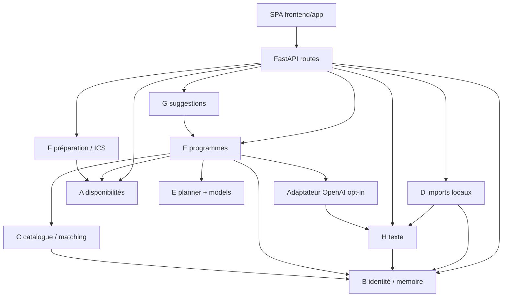

# Architecture actuelle de Chandelle

Audit statique du workspace, le 26 septembre 2026. Ce document décrit le code présent, y compris la compatibilité historique ; il ne propose aucune réorganisation.

Périmètre : sources, manifests, scripts, tests, fixtures et documentation. Exclus : `.git` (seules ses métadonnées sont interrogées par Git), `node_modules`, `.venv`, `__pycache__`, `dist`, `build`, `.next`, caches, fichiers d’environnement et de secrets. Les données privées de `.runtime`, bases SQLite, clés et archives binaires ne sont pas ouvertes. L’archive locale apparue pendant l’audit est uniquement signalée par son nom. Les documents historiques sont des éléments à analyser, pas des instructions exécutées.

Aucun serveur, test, import du module applicatif ou appel fournisseur n’a été lancé. Les versions installées et le contenu des données locales ne sont donc pas attestés. Les commandes ci-dessous sont documentées, pas exécutées durant cet audit.

## 1. Branche actuelle et état Git

Dernier relevé avant création de ce document :

- Branche : `noe/architecture-actuelle`.
- HEAD : `87f0ac35eced773b3ebca33367bfa9ae0079a06f` — « Snapshot de l’architecture actuelle de Chandelle ».
- Aucun changement suivi ni changement indexé ; seul `chandelle-code.zip` est non suivi.
- La création du présent document ajoute ensuite `?? docs/ARCHITECTURE_CURRENT.md`.
- Aucun commit, changement de branche, fetch, push ou modification d’index réalisé par cet audit.

Le workspace a changé de branche et de commit pendant la lecture, par une action extérieure à cet audit. Au premier relevé, il était sur `codex/noe-v2`, HEAD `fa171af8117c1c470a26f1694b2311d230357a12`, avec 20 fichiers suivis modifiés, 93 supprimés, 38 non suivis et aucun changement indexé. Une comparaison SHA-256 des **91 fichiers textuels inventoriés** confirme que leur contenu est identique entre ces deux relevés : l’analyse de code reste applicable au nouveau commit.

Références locales observées, sans interrogation réseau :
```text
codex/e-supervision 092cb3a
codex/noe-v2 fa171af
codex/v2-full-app 092cb3a
main 7c99930
noe/architecture-actuelle 87f0ac3
origin/codex/noe-v2 fa171af
origin/main e86a758
origin/noe/architecture-actuelle 87f0ac3
```

Les références `origin/*` sont celles enregistrées localement ; leur présence ne prouve pas l’état actuel du serveur distant. Aucun conflit de fusion n’est signalé dans le dernier état Git.

## 2. Arborescence réelle

Inventaire des 91 fichiers sources/documentaires autorisés avant création du rapport, plus le nom de l’archive non inspectée. Les répertoires exclus et leurs contenus ne sont pas représentés. Ce document lui-même est le seul ajout de l’audit.

```text
├── .DS_Store
├── .gitignore
├── AGENTS.md
├── README.md
├── backend
│   ├── api
│   │   ├── __init__.py
│   │   ├── app.py
│   │   ├── legacy_orchestrator.py
│   │   ├── routes.py
│   │   └── static
│   │       ├── app.js
│   │       ├── index.html
│   │       └── styles.css
│   ├── db
│   │   ├── __init__.py
│   │   └── database.py
│   ├── integrations
│   │   ├── openai.py
│   │   └── urls.py
│   ├── requirements.txt
│   ├── shared
│   │   ├── README.md
│   │   ├── activity.json
│   │   ├── couple-profile.json
│   │   ├── date-plan.json
│   │   └── time-widow.json
│   ├── streams
│   │   ├── A_calendar
│   │   │   └── service.py
│   │   ├── B_memory
│   │   │   ├── __init__.py
│   │   │   ├── legacy.py
│   │   │   ├── onboarding.py
│   │   │   └── service.py
│   │   ├── C_discovery
│   │   │   ├── __init__.py
│   │   │   ├── legacy.py
│   │   │   ├── paris_activities.json
│   │   │   └── service.py
│   │   ├── D_connectors
│   │   │   └── service.py
│   │   ├── E_orchestrator
│   │   │   ├── __init__.py
│   │   │   ├── adapters.py
│   │   │   ├── legacy.py
│   │   │   ├── models.py
│   │   │   ├── planner.py
│   │   │   ├── repository.py
│   │   │   └── service.py
│   │   ├── F_booking
│   │   │   └── service.py
│   │   ├── G_proactive
│   │   │   ├── __init__.py
│   │   │   ├── legacy.py
│   │   │   └── service.py
│   │   └── H_conversation
│   │       ├── __init__.py
│   │       ├── legacy.py
│   │       └── service.py
│   └── tests
│       ├── test_api.py
│       ├── test_architecture.py
│       ├── test_discovery.py
│       ├── test_journeys.py
│       ├── test_legacy_api.py
│       ├── test_memory.py
│       ├── test_openai.py
│       └── test_orchestrator.py
├── chandelle-code.zip [archive non ouverte]
├── docs
│   ├── .DS_Store
│   ├── codex-E
│   │   ├── AGENTS-E.md
│   │   ├── AVANCEMENT.md
│   │   ├── PREFLIGHT.md
│   │   └── RAPPORT-FINAL.md
│   ├── night-shift
│   │   ├── AGENTS-V1.md
│   │   ├── CONTRACTS.md
│   │   ├── DECISIONS.md
│   │   ├── FINAL_REPORT.md
│   │   ├── GOAL.txt
│   │   ├── HANDOFFS.md
│   │   ├── MASTER_PLAN.md
│   │   ├── STATE.md
│   │   └── TEST_MATRIX.md
│   └── v2
│       ├── ARCHITECTURE.md
│       ├── CONTRACTS.md
│       ├── DECISIONS.md
│       ├── STATE.md
│       ├── TEST_MATRIX.md
│       └── archive
│           └── HISTORY.md
├── frontend
│   ├── AGENTS.md
│   ├── README.md
│   ├── app
│   │   ├── app.mjs
│   │   ├── experiences.mjs
│   │   ├── index.html
│   │   └── style.css
│   └── tests
│       ├── test_experiences.mjs
│       └── test_ui.mjs
├── mocks
│   ├── E
│   │   └── activities.json
│   ├── README.md
│   └── peer
│       └── catalogue.json
└── scripts
    ├── check.sh
    ├── init_demo.py
    ├── live_openai_smoke.py
    ├── reset_demo.sh
    ├── run.sh
    ├── test_offline.py
    └── verify_frontend_api.py
```

Il n’existe actuellement ni `backend/domain/`, ni package npm actif, ni `README-SETUP.md`, ni `backend/api/pipeline.py`, ni `backend/api/external.py`. Les anciens onglets IDE peuvent donc désigner des chemins supprimés ou déplacés.

## 3. Technologies et dépendances

Monolithe Python/FastAPI, SQLite via la bibliothèque standard, interface HTML/CSS/JavaScript à modules natifs. Les huit streams sont des modules du même processus, pas huit services déployables.

| Dépendance déclarée dans backend/requirements.txt | Version épinglée | Usage |
| --- | --- | --- |
| fastapi | 0.141.1 | HTTP, dépendances d’authentification, OpenAPI, fichiers statiques |
| uvicorn | 0.54.0 | Serveur ASGI |
| pydantic | 2.13.5 | Validation des requêtes, contrats E et sorties structurées |
| httpx | 0.28.1 | Client de test / dépendance HTTP |
| pytest | 9.1.1 | Tests Python |
| openai | 3.19.2 | Adaptateur optionnel Responses et embeddings |

Le README demande Python 3.11+ et Node 18+ pour les tests JS. Pas de `pyproject.toml`, gestionnaire ORM, Alembic, Redis, queue, serveur Node, build Next/React, TypeScript actif, Dockerfile ou configuration CI dans l’inventaire. Les dépendances transitives ne sont pas toutes verrouillées dans un lockfile.

Bibliothèque standard notable : `sqlite3`, `zoneinfo`, `datetime`, `hashlib`, `secrets`, `json`, `csv`, `re`, `threading`, `itertools`. FTS5 SQLite est facultatif ; la recherche peut fonctionner sans cette extension. La sémantique locale utilise un vecteur de hachage de tokens à 64 dimensions, pas un modèle de langage.

## 4. Points d’entrée

| Entrée | Comportement réel |
| --- | --- |
| `bash scripts/run.sh` | Lance `.venv/bin/python -m uvicorn backend.api.app:app`, sur l’interface locale ; port configurable |
| `backend/api/app.py:create_app(db_path=None)` | Assemble V1 et API actuelle, monte les deux interfaces |
| `backend/api/app.py:app` | Instance globale construite à l’import |
| `/`, `/app` | Servent `frontend/app/index.html` |
| `/v2-static` | Monte `frontend/app/` ; aucun serveur front distinct |
| `/v1/demo`, `/static` | Ancienne interface dans `backend/api/static/` |
| `backend/api/legacy_orchestrator.py:app` | Ancienne API E autonome, distincte de l’application principale |
| `/docs`, `/redoc`, `/openapi.json` | Documentation générée par FastAPI |

**L’import de l’application a des effets d’écriture** : initialisation des repositories, schéma SQLite, seed du catalogue. C’est pourquoi l’audit utilise lecture/AST et non import Python.

Par défaut, V1 et produit actuel ont des fichiers SQLite distincts sous `.runtime` ; le produit actuel utilise `chandelle_v2.sqlite3`. Un chemin explicite passé à `create_app` est réutilisé pour les deux générations de tables. Les uploads sont placés à côté de cette base dans `uploads/`. La seconde API E conserve ses runs dans un dictionnaire en mémoire, sans persistance.

## 5. Commandes actuellement disponibles

Depuis la racine, d’après les scripts et README :

| Commande | Effet |
| --- | --- |
| `python3 -m venv .venv` | Crée l’environnement Python |
| `.venv/bin/python -m pip install -r backend/requirements.txt` | Installe les dépendances ; nécessite initialement le réseau |
| `bash scripts/run.sh` | Lance l’application et le front |
| `bash scripts/check.sh` | Vérifications Python, JS, parcours API, syntaxe shell et diff |
| `.venv/bin/python scripts/init_demo.py` | Initialise l’application et la base |
| `.venv/bin/python scripts/init_demo.py --database CHEMIN --seed` | Initialise une base choisie et crée un couple de démonstration |
| `bash scripts/reset_demo.sh --confirm-reset-local-v2` | Efface la base de démonstration actuelle et ses fichiers associés ; commande destructive, non exécutée |
| `.venv/bin/python scripts/live_openai_smoke.py` | Smoke fournisseur explicitement opt-in ; refuse de fonctionner sans activation prévue |
| `.venv/bin/python -m uvicorn backend.api.legacy_orchestrator:app` | Lance l’ancienne API E séparément |

Le seed peut écrire une session contenant les capacités locales dans `.runtime/demo-session.json`, avec permissions restrictives. Même avec une base personnalisée, ce chemin de session est fixe. L’import préalable de `app.py` peut aussi initialiser la base par défaut.

Les scripts ne chargent pas automatiquement `.env`. Les commandes de développement API `/dev/seed` et `/dev/reset` sont protégées par le mode développeur, pas par une authentification de production. Le reset shell demande d’arrêter le serveur et conserve la base V1.

## 6. Modules fonctionnels existants

| Capacité | Fichiers actuels | Responsabilités observées |
| --- | --- | --- |
| Intégrations techniques | `backend/integrations/openai.py`, `urls.py` | Adaptateur OpenAI opt-in, validation/canonicalisation d’URL |
| Imports de plateformes, D | `streams/D_connectors/service.py` | Notes/exports locaux Google Maps, Instagram, TikTok ; extraction, déduplication, confirmation vers B |
| Calendrier, A | `streams/A_calendar/service.py` | Créneaux individuels, intersection, UTC/Paris, créneau démo |
| Mémoire, B | `streams/B_memory/service.py` | Faits, consentement, provenance, conflits, recherche, snapshots, profils dérivés |
| Identité et onboarding, B | `streams/B_memory/onboarding.py` | Couple de deux personnes, jetons hachés, entretien en sept étapes, verrou d’accès produit |
| Discovery, C | `streams/C_discovery/service.py` | Seed, catalogue, recherche, contraintes, score individuel/couple, états d’activité |
| Matching | `C_discovery/service.py` puis `E_orchestrator/planner.py` | Deux étapes de scoring ; aucun module ou stream « matching » autonome |
| Orchestration, E | `streams/E_orchestrator/service.py` | Appels A/B/C, runs, plans persistés, statuts, remplacements, avis et historique |
| Moteur commun E | `models.py`, `planner.py` | Contrats Pydantic et composition déterministe partagée V1/actuelle |
| Préparation, F | `streams/F_booking/service.py` | Préparation humaine, liens autorisés, export ICS ; aucun achat |
| Proactivité, G | `streams/G_proactive/service.py` | Suggestions persistées, déduplication, expiration, snooze, acceptation via E |
| Conversation, H | `streams/H_conversation/service.py` | Vocabulaire FR/EN, analyse locale de demande, messages et extraction injectée vers B |
| API | `api/app.py`, `routes.py` | Composition, validation HTTP, identité, accès, uploads et effacement transverse |
| Stockage | `db/database.py`, `db/__init__.py` | Schéma et connexions SQLite, horodatage UTC et sérialisation JSON |
| Front | `frontend/app/app.mjs`, `experiences.mjs`, HTML/CSS | SPA et appels réels aux endpoints locaux |

### Compatibilité V1 réellement chargée

`legacy.py` existe dans B/C/E/G/H. Les packages B/C/G/H réexportent les symboles V1 depuis `__init__.py` ; importer `MemoryService` du package B ne sélectionne pas `MemoryServiceV2`.

L’application principale construit toujours les services V1. `E_orchestrator/legacy.py:DatePipeline` orchestre B/C/E historiques ; H reçoit demandes et feedback ; G fournit l’ancienne vérification proactive. `E/adapters.py` traduit les profils provisoires vers E et `repository.py` charge la fixture E. Ce ne sont pas des fichiers sans appelants.

### Matching et faisabilité

C filtre les contraintes avant classement : fenêtre, jours, budget, exclusions des profils, contraintes pratiques, déplacement/rayon et retours d’activité. Sa formule couple combine 60 % du minimum des scores individuels et 40 % de leur moyenne, avec bonus/malus de préférences, recherche, historique, distance et diversité.

E recompose ensuite les candidats : budget total pour deux, ordre horaire, temps de trajet estimé, variété et satisfaction des deux personnes. Sa formule individuelle/couple diffère : 55 % du minimum et 45 % de la moyenne, puis bonus de nouveauté et composition. Avec les scores individuels fournis par C, le `match_score` composite de C n’est pas simplement repris comme score final.

Le moteur E conserve une limite historique de quatre activités par défaut ; le service actuel transmet explicitement une limite de une à trois. `activity_count` est un maximum, pas une obligation d’atteindre ce nombre. Le catalogue et les disponibilités commerciales restent fictifs.

## 7. Modèles et contrats JSON/Pydantic

### Contrats de planification communs

`E_orchestrator/models.py` est le contrat exécutable commun :

- `TimeWindow` : datetimes début/fin, fin strictement postérieure, convention de fuseau cohérente, durée optionnelle positive correspondant à la différence.
- `Location` : latitude/longitude bornées.
- `CandidateActivity` : identifiant, type, nom, horaires **HH:MM**, prix par personne non négatif, position, score borné, URL optionnelle, tags, scores A/B optionnels.
- `DatePlan` : identifiant, début/fin datetimes, coût total du couple, raison, au moins une activité. La limite de trois n’est pas intrinsèque à ce modèle.
- `PlanRequest` / `ReplaceRequest` / `PlansResponse` : interface du moteur historique et de l’API E autonome.

Il existe deux classes `CoupleProfile` et deux `PersonPreferences` : celles de B legacy contiennent la mémoire historique ; celles de E sont le contrat réduit pour planifier. Ce sont des représentations différentes, reliées par adapters.

### Contrats actuels

`Query` ajoute texte, budget, catégories, rayon, mode, fenêtre facultative, choix imposé simple ou liste de trois maximum, nombre maximal de plans et d’activités. `Review` porte note, notes par activité, texte, préférences à répéter/éviter, confidentialité et clé d’idempotence.

`Answer` valide sept étapes et leur structure interne : identité, goûts, exclusions, budget et unité, style, contraintes pratiques, expérience libre. Les étapes facultatives peuvent être sautées. La fin des deux entretiens conditionne les routes produit.

Consentements B :
- `PRIVATE` : propriétaire seulement ; exclu du contexte de planification.
- `COUPLE_RECOMMENDATION` : influence structurée autorisée, sans affichage verbatim au partenaire.
- `SHARED` : contenu explicitement partageable.

Scopes : `PERSON`, `COUPLE`, `DATE`, `SESSION`. L’API vérifie aussi les identifiants de session/date ; ces contrôles ne sont pas tous contenus dans la validation Pydantic ni dans B seul.

Les faits sont des dictionnaires persistés avec identité/couple/scope/propriétaire, catégorie/clé/valeur/tags, consentement, confiance/saillance, dates, renforcement, supersession/contradiction/source/suppression. Catalogue, profils, runs et plans enrichis sont largement des `dict` JSON, sans modèle de réponse Pydantic complet.

Les plans actuels enrichissent E avec UUID, statut, timeline, coût total/par personne, scores A/B, preuves, source et activités de catalogue. Les snapshots privés `_e_plan`, `_profile`, `_candidates` restent persistés pour le remplacement et sont retirés des réponses publiques. Avis et photos sont ajoutés selon le lecteur, pas persistés dans le payload public du plan.

### Registre des classes Pydantic présentes

Les champs ci-dessous sont déclarés directement ; `ReplaceRequest` hérite aussi de `PlanRequest`, et les sorties OpenAI héritent de `Structured` (champs supplémentaires interdits). Les contraintes fines restent dans les fichiers cités.

| Fichier | Classe | Champs déclarés et types |
| --- | --- | --- |
| `backend/api/legacy_orchestrator.py` | `RunStatus` | `run_id: str`; `status: str`; `started_at: datetime`; `finished_at: datetime \| None`; `plan_count: int`; `error: str \| None` |
| `backend/api/routes.py` | `MemoryCreate` | `scope: Literal['PERSON', 'COUPLE', 'SESSION', 'DATE']`; `entity_id: str`; `category: str`; `key: str`; `value: str \| dict \| list \| float \| int`; `privacy_scope: Privacy` |
| `backend/api/routes.py` | `MemoryPatch` | `value: str \| dict \| list \| float \| int \| None`; `category: str \| None`; `tags: list[str] \| None`; `privacy_scope: Privacy \| None`; `salience: float \| None`; `confidence: float \| None` |
| `backend/api/routes.py` | `Share` | `privacy_scope: Privacy` |
| `backend/api/routes.py` | `State` | `state: Literal['saved', 'liked', 'disliked', 'rejected', 'neutral']` |
| `backend/api/routes.py` | `PlanChange` | `status: Literal['draft', 'proposed', 'accepted', 'completed', 'cancelled'] \| None`; `kept_ids: list[str] \| None` |
| `backend/api/routes.py` | `Comparison` | `activity_ids: list[str]` |
| `backend/api/routes.py` | `Replacement` | `activity_id: str` |
| `backend/api/routes.py` | `Action` | `action: Literal['viewed', 'accepted', 'dismissed', 'snoozed', 'regenerate']` |
| `backend/api/routes.py` | `Reset` | `confirmation: str` |
| `backend/integrations/openai.py` | `Structured` | Aucun champ propre |
| `backend/integrations/openai.py` | `ParsedRequest` | `budget: float \| None`; `categories: list[str]`; `excluded: list[str]` |
| `backend/integrations/openai.py` | `ExtractedFact` | `category: Literal['interests', 'dislikes', 'budget', 'experience']`; `value: str`; `confidence: float` |
| `backend/integrations/openai.py` | `Extraction` | `facts: list[ExtractedFact]` |
| `backend/integrations/openai.py` | `Conflict` | `classification: Literal['equivalent', 'supersedes', 'contradicts', 'unrelated']` |
| `backend/integrations/openai.py` | `Explanation` | `candidate_ids: list[str]`; `explanation: str` |
| `backend/integrations/openai.py` | `Ranking` | `candidate_ids: list[str]` |
| `backend/streams/A_calendar/service.py` | `AvailabilityInput` | `slots: list[TimeWindow]` |
| `backend/streams/B_memory/legacy.py` | `PersonPreferences` | `interests: list[str]`; `dislikes: list[str]` |
| `backend/streams/B_memory/legacy.py` | `PreferenceFact` | `person: Literal['user_a', 'user_b']`; `kind: Literal['interest', 'dislike']`; `value: str`; `source: str`; `observed_at: datetime` |
| `backend/streams/B_memory/legacy.py` | `DateHistoryEntry` | `date_plan_id: str`; `occurred_at: datetime`; `activities: list[str]`; `source: str`; `recorded_at: datetime` |
| `backend/streams/B_memory/legacy.py` | `SelectionRecord` | `date_plan_id: str`; `decision: Literal['selected', 'rejected']`; `source: str`; `recorded_at: datetime` |
| `backend/streams/B_memory/legacy.py` | `FeedbackRecord` | `date_plan_id: str`; `rating: int \| None`; `sentiment: Literal['positive', 'neutral', 'negative'] \| None`; `liked_tags: list[str]`; `disliked_tags: list[str]`; `text: str \| None`; `source: str`; `recorded_at: datetime` |
| `backend/streams/B_memory/legacy.py` | `CoupleProfile` | `couple_id: str`; `user_a: PersonPreferences \| None`; `user_b: PersonPreferences \| None`; `shared_interests: list[str]`; `dislikes: list[str]`; `typical_budget: float \| None`; `desired_novelty: float`; `recent_dates: list[str]`; `preference_facts: list[PreferenceFact]`; `date_history: list[DateHistoryEntry]`; `selections: list[SelectionRecord]`; `feedback: list[FeedbackRecord]`; `updated_at: datetime` |
| `backend/streams/B_memory/legacy.py` | `ProfileUpdate` | `user_a: PersonPreferences \| None`; `user_b: PersonPreferences \| None`; `shared_interests: list[str]`; `dislikes: list[str]`; `typical_budget: float \| None`; `desired_novelty: float \| None`; `source: str`; `observed_at: datetime` |
| `backend/streams/B_memory/onboarding.py` | `CoupleCreate` | `person_a: str`; `person_b: str` |
| `backend/streams/B_memory/onboarding.py` | `Answer` | `step: int`; `value: dict`; `privacy_scope: Privacy` |
| `backend/streams/C_discovery/legacy.py` | `ActivityListing` | `candidate: CandidateActivity`; `weekdays: list[int]` |
| `backend/streams/C_discovery/legacy.py` | `DiscoveryConstraints` | `include_types: list[str]`; `required_tags: list[str]`; `excluded_tags: list[str]`; `max_total_budget: float \| None`; `limit: int` |
| `backend/streams/D_connectors/service.py` | `SignalImport` | `platform: Literal['manual', 'google_maps', 'instagram', 'tiktok']`; `format: Literal['text', 'json', 'csv']`; `content: str`; `privacy_scope: Privacy`; `signal_at: str \| None`; `horizon: Literal['durable', 'temporary']` |
| `backend/streams/D_connectors/service.py` | `SignalConfirm` | `tags: list[str]`; `privacy_scope: Privacy`; `horizon: Literal['durable', 'temporary']` |
| `backend/streams/E_orchestrator/legacy.py` | `CoreRequest` | `couple_id: str`; `time_window: TimeWindow`; `profile_update: ProfileUpdate \| None`; `discovery: DiscoveryConstraints`; `max_plans: int` |
| `backend/streams/E_orchestrator/legacy.py` | `TraceStep` | `stream: str`; `detail: str` |
| `backend/streams/E_orchestrator/legacy.py` | `PlanResult` | `run_id: str`; `status: str`; `plans: list[DatePlan]`; `trace: list[TraceStep]`; `rejected: dict[str, str]`; `external_systems: str`; `booking_requires_human_confirmation: bool`; `availability: TimeWindow \| None`; `budget_cap: float \| None` |
| `backend/streams/E_orchestrator/legacy.py` | `ActivityReplacement` | `couple_id: str`; `time_window: TimeWindow`; `plan: DatePlan`; `replace_activity_id: str`; `budget_cap: float \| None` |
| `backend/streams/E_orchestrator/legacy.py` | `RunRecord` | `run_id: str`; `status: str`; `started_at: datetime`; `finished_at: datetime \| None`; `error: str \| None`; `trace: list[TraceStep]`; `plan_count: int` |
| `backend/streams/E_orchestrator/models.py` | `TimeWindow` | `start: datetime`; `end: datetime`; `duration_minutes: int \| None` |
| `backend/streams/E_orchestrator/models.py` | `PersonPreferences` | `interests: list[str]`; `dislikes: list[str]` |
| `backend/streams/E_orchestrator/models.py` | `CoupleProfile` | `shared_interests: list[str]`; `dislikes: list[str]`; `typical_budget: Money \| None`; `desired_novelty: Score`; `recent_dates: list[str]`; `user_a: PersonPreferences \| None`; `user_b: PersonPreferences \| None` |
| `backend/streams/E_orchestrator/models.py` | `Location` | `lat: float`; `lng: float` |
| `backend/streams/E_orchestrator/models.py` | `CandidateActivity` | `id: str`; `type: str`; `name: str`; `start: str`; `end: str`; `price_per_person: Money`; `location: Location`; `match_score: Score`; `booking_url: str \| None`; `tags: list[str]`; `user_a_score: Score \| None`; `user_b_score: Score \| None` |
| `backend/streams/E_orchestrator/models.py` | `PlannedActivity` | `id: str`; `type: str`; `name: str`; `start: str`; `end: str`; `price_per_person: Money`; `location: Location`; `match_score: Score`; `why: str`; `booking_url: str \| None` |
| `backend/streams/E_orchestrator/models.py` | `DatePlan` | `date_plan_id: str`; `start: datetime`; `end: datetime`; `estimated_total_eur: Money`; `reason: str`; `activities: list[PlannedActivity]` |
| `backend/streams/E_orchestrator/models.py` | `PlanRequest` | `time_window: TimeWindow`; `couple_profile: CoupleProfile`; `candidate_activities: list[CandidateActivity] \| None`; `constraints: str \| None`; `max_plans: int` |
| `backend/streams/E_orchestrator/models.py` | `ReplaceRequest` | `plan: DatePlan`; `replace_activity_id: str` |
| `backend/streams/E_orchestrator/models.py` | `PlansResponse` | `run_id: str`; `status: str`; `plans: list[DatePlan]`; `rejected: dict[str, str]` |
| `backend/streams/E_orchestrator/service.py` | `Query` | `text: str`; `budget: float \| None`; `categories: list[str]`; `required_activity_id: str \| None`; `required_activity_ids: list[str]`; `radius_km: float \| None`; `activity_count: int`; `max_plans: int`; `mode: Literal['offline', 'openai']`; `time_window: TimeWindow \| None` |
| `backend/streams/E_orchestrator/service.py` | `Review` | `rating: int`; `activity_ratings: dict[str, int]`; `text: str`; `repeat: list[str]`; `avoid: list[str]`; `privacy_scope: Privacy`; `idempotency_key: str` |
| `backend/streams/G_proactive/legacy.py` | `ProactiveCheck` | `couple_id: str`; `time_window: TimeWindow \| None` |
| `backend/streams/G_proactive/legacy.py` | `OpportunityDecision` | `triggered: bool`; `reason: str`; `days_since_previous_date: int \| None`; `candidate_count: int`; `availability: TimeWindow`; `result: PlanResult \| None` |
| `backend/streams/H_conversation/legacy.py` | `ParsedConstraints` | `budget: float \| None`; `preferred_tag: str \| None`; `excluded_tags: list[str]` |
| `backend/streams/H_conversation/legacy.py` | `DateRequest` | `couple_id: str`; `text: str`; `time_window: TimeWindow \| None`; `budget: float \| None`; `categories: list[str]`; `required_tags: list[str]`; `excluded_tags: list[str]`; `profile_update: ProfileUpdate \| None`; `max_plans: int` |
| `backend/streams/H_conversation/legacy.py` | `FeedbackRequest` | `couple_id: str`; `date_plan_id: str`; `rating: int \| None`; `sentiment: Literal['positive', 'neutral', 'negative'] \| None`; `liked_tags: list[str]`; `disliked_tags: list[str]`; `text: str \| None`; `decision: Literal['selected', 'rejected'] \| None`; `occurred_at: datetime \| None`; `activities: list[str]` |
| `backend/streams/H_conversation/service.py` | `Conversation` | `text: str`; `privacy_scope: Privacy`; `mode: Literal['offline', 'openai']` |

### JSON partagés et fixtures

- `backend/shared/activity.json` et `date-plan.json` sont **vides** (0 octet), donc pas des documents JSON valides.
- `backend/shared/time-widow.json` conserve une faute dans son nom ; c’est un exemple de fenêtre, pas un JSON Schema.
- `backend/shared/couple-profile.json` est un exemple utilisant notamment `likes`, `budget_per_person_max`, `novelty_preference`. E adapte ces noms vers `shared_interests`, budget couple et nouveauté.
- Ces fichiers shared ne sont pas chargés pour valider le runtime ; `models.py` assure cette fonction.
- Catalogue V1 : 12 entrées dans `C_discovery/paris_activities.json`.
- Fixture E autonome : 4 candidats dans `mocks/E/activities.json`.
- Catalogue ami : 36 entrées dans `mocks/peer/catalogue.json`, format compact adapté par C. Le seed natif génère 40 exemples ; la composition API ajoute les 36, soit 76 dans une base neuve.

### Registre HTTP constaté

Les routes de `routes.py` portent toutes le préfixe `/api/v2`. Les routes de `legacy_orchestrator.py` ne sont disponibles que dans son application autonome. Les montages statiques et la documentation FastAPI sont décrits en section 4.

| Application / fichier | Méthode | Chemin effectif | Handler |
| --- | --- | --- | --- |
| `app.py` | GET | `/` | `demo_page` |
| `app.py` | GET | `/v1/demo` | `legacy_demo_page` |
| `app.py` | GET | `/health` | `health` |
| `app.py` | POST | `/v1/date/request` | `request_date` |
| `app.py` | POST | `/v1/date/feedback` | `feedback` |
| `app.py` | POST | `/v1/date/replace` | `replace_activity` |
| `app.py` | GET | `/v1/couples/{couple_id}/memory` | `memory_snapshot` |
| `app.py` | GET | `/v1/runs/{run_id}` | `run_status` |
| `app.py` | POST | `/v1/proactive/check` | `proactive_check` |
| `app.py` | GET | `/app` | `v2_page` |
| `legacy_orchestrator.py` | POST | `/plans` | `create_plans` |
| `legacy_orchestrator.py` | POST | `/plans/replace` | `replace_activity` |
| `legacy_orchestrator.py` | GET | `/runs/{run_id}` | `get_run` |
| `legacy_orchestrator.py` | GET | `/health` | `health` |
| `routes.py` | GET | `/api/v2/health` | `health` |
| `routes.py` | GET | `/api/v2/integrations` | `integrations` |
| `routes.py` | POST | `/api/v2/onboarding/couples` | `create` |
| `routes.py` | GET | `/api/v2/onboarding/status` | `status` |
| `routes.py` | GET | `/api/v2/onboarding/couples/{cid}/members/{uid}` | `interview` |
| `routes.py` | PUT | `/api/v2/onboarding/couples/{cid}/members/{uid}/answers` | `answer` |
| `routes.py` | POST | `/api/v2/onboarding/couples/{cid}/members/{uid}/complete` | `complete` |
| `routes.py` | GET | `/api/v2/users` | `users` |
| `routes.py` | GET | `/api/v2/couples` | `couples` |
| `routes.py` | GET | `/api/v2/couples/{cid}/profile` | `couple_profile` |
| `routes.py` | GET | `/api/v2/profiles/{scope}/{eid}` | `profile` |
| `routes.py` | GET | `/api/v2/memories/search` | `search` |
| `routes.py` | GET | `/api/v2/memories` | `memories` |
| `routes.py` | POST | `/api/v2/memories` | `add_memory` |
| `routes.py` | PATCH | `/api/v2/memories/{mid}` | `edit_memory` |
| `routes.py` | DELETE | `/api/v2/memories/{mid}` | `delete_memory` |
| `routes.py` | POST | `/api/v2/memories/{mid}/share` | `share_memory` |
| `routes.py` | GET | `/api/v2/memories/export/{scope}/{eid}` | `export` |
| `routes.py` | GET | `/api/v2/memories/{mid}/provenance` | `provenance` |
| `routes.py` | DELETE | `/api/v2/memories/entity/{scope}/{eid}` | `erase_entity` |
| `routes.py` | GET | `/api/v2/activities` | `activities` |
| `routes.py` | GET | `/api/v2/activities/{aid}` | `activity` |
| `routes.py` | POST | `/api/v2/activities/{aid}/state` | `activity_state` |
| `routes.py` | POST | `/api/v2/recommendations/query` | `recommend` |
| `routes.py` | GET | `/api/v2/availability` | `availability_state` |
| `routes.py` | PUT | `/api/v2/availability` | `availability_save` |
| `routes.py` | GET | `/api/v2/inspirations` | `inspiration_list` |
| `routes.py` | POST | `/api/v2/inspirations/import` | `inspiration_import` |
| `routes.py` | POST | `/api/v2/inspirations/{mid}/confirm` | `inspiration_confirm` |
| `routes.py` | POST | `/api/v2/activities/compare` | `compare` |
| `routes.py` | POST | `/api/v2/date-plans/{pid}/booking` | `prepare_booking` |
| `routes.py` | GET | `/api/v2/date-plans/{pid}/calendar` | `export_calendar` |
| `routes.py` | GET | `/api/v2/date-plans` | `plans` |
| `routes.py` | GET | `/api/v2/date-plans/{pid}` | `plan` |
| `routes.py` | PATCH | `/api/v2/date-plans/{pid}` | `change_plan` |
| `routes.py` | POST | `/api/v2/date-plans/{pid}/replace` | `replace_plan` |
| `routes.py` | POST | `/api/v2/date-plans/{pid}/feedback` | `feedback` |
| `routes.py` | GET | `/api/v2/history` | `history` |
| `routes.py` | GET | `/api/v2/history/{pid}` | `history_detail` |
| `routes.py` | GET | `/api/v2/suggestions` | `feed` |
| `routes.py` | POST | `/api/v2/suggestions/check` | `check` |
| `routes.py` | POST | `/api/v2/suggestions/{sid}/action` | `suggestion_action` |
| `routes.py` | GET | `/api/v2/runs/{rid}` | `run` |
| `routes.py` | POST | `/api/v2/uploads` | `upload` |
| `routes.py` | GET | `/api/v2/uploads/{uid}` | `get_photo` |
| `routes.py` | DELETE | `/api/v2/uploads/{uid}` | `delete_photo` |
| `routes.py` | POST | `/api/v2/conversations` | `conversation` |
| `routes.py` | DELETE | `/api/v2/users/me/data` | `erase_person` |
| `routes.py` | POST | `/api/v2/dev/seed` | `seed` |
| `routes.py` | POST | `/api/v2/dev/reset` | `reset` |

Dans l’API actuelle, health, integrations, création du couple et état public d’onboarding sont publics ; les entretiens/users/couples utilisent la capacité du membre. Les routes produit utilisent généralement `ready`, qui exige les deux entretiens terminés. L’effacement personnel utilise l’authentification sans imposer la fin des entretiens ; les commandes dev utilisent leur garde d’environnement propre. Les endpoints V1 et E autonome ne partagent pas cette couche d’identité.

### Stockage SQL actuel

`Database` initialise le schéma par `CREATE TABLE IF NOT EXISTS`, en mode WAL, clés étrangères activées et timeout. Le registre principal reste à la version 1 et l’extension `peer_merge` à la version 1. Il n’existe pas de chaîne de migrations Alembic ni de migrations `ALTER` ordonnées.

| Tables | Contenu / utilisateurs |
| --- | --- |
| v2_schema, v2_extensions | Registres de schéma |
| v2_users, v2_couples, v2_memberships, v2_answers | Identité, capacité hachée, couple, entretiens — B et API |
| v2_facts, v2_events | Mémoire et journal de provenance — B |
| v2_entities, v2_links, v2_embeddings, v2_snapshots | Entités liées, vecteurs locaux, profils versionnés — B |
| v2_activities, v2_activity_states | Catalogue et choix personnels — C |
| v2_plans, v2_reviews, v2_runs | Plans JSON, avis, traces — E ; lecture API/G |
| v2_uploads | Métadonnées des photos ; contenu sur disque — API |
| v2_suggestions | Suggestions et temporisation — G, invalidation A/API |
| v2_conversations, v2_messages | Sessions et texte — H |
| v2_availability | Créneaux personnels — A |

Ces 22 tables sont définies dans `database.py`. B peut créer `v2_memory_fts` et les tables auxiliaires FTS5. La table historique `couple_profiles` appartient au repository B legacy ; ce n’est pas un alias de `v2_facts`.

## 8. Flux de données

### Parcours actuel

1. Front → création du couple → B onboarding : deux capacités sont délivrées, leurs hachés sont conservés en SQL. Le navigateur garde la session et les deux capacités dans localStorage.
2. Réponses individuelles → B onboarding → B faits/événements/snapshots ; fin des deux entretiens → déverrouillage de l’API produit.
3. D imports → normalisation/déduplication → faits B d’inspiration en attente → confirmation explicite → intérêts autorisés et pondérés. Aucun téléchargement de page ou vidéo.
4. A saisies → normalisation UTC → intersection du couple → fenêtres communes. Une modification invalide les suggestions en attente.
5. Demande front → API → E : parse local ou OpenAI → contexte B filtré → fenêtres A → candidats C → composition E → persistance du run et du plan → réponse publique.
6. Remplacement → E relit les snapshots du plan et les préférences actuelles, protège les activités conservées, cherche une alternative et remplace le payload du même plan.
7. Avis → E → review SQL et faits B → préférences/historique mis à jour. Favori/aversion d’activité → C → état personnel et mémoire B.
8. G consulte historique/signaux/états et appelle E pour une suggestion ; acceptation → statut du plan E. Le contrôle est déclenché par requête, sans scheduler de fond.
9. Plan accepté/terminé → F → préparation manuelle ou fichier ICS. Aucun fournisseur n’est contacté.
10. H conversation → extraction injectée → messages SQL et faits B. Le chemin de conversation est distinct de la requête de recommandation.
11. Upload → API → fichier privé + ligne SQL ; affichage par le propriétaire seulement. Effacement personnel coordonné par l’API sur plusieurs tables et fichiers.



Le stockage SQL partagé est utilisé directement par les services et certaines routes. Le diagramme indique les collaborations, pas une isolation transactionnelle ou des appels réseau.

### Parcours V1 et API E autonome

V1 UI → routes `/v1` → H legacy → E DatePipeline → B snapshot et C catalogue V1 → adapters/modèles/planner E. Feedback et proactivité utilisent B/G legacy. Les runs V1 et ceux de l’API E autonome sont en mémoire de processus, contrairement aux `v2_runs`.

API E autonome → `PlanRequest` / `ReplaceRequest` → candidats fournis ou fixture E → moteur déterministe → `PlansResponse`. Elle n’ajoute pas l’onboarding et la mémoire actuelle.

## 9. Imports entre features

Le graphe est centralisé par `api/routes.py`, qui importe tous les streams actuels. Aucun import de l’API depuis un stream n’a été relevé ; le stockage n’importe pas le métier. Des dépendances de types pointent vers E depuis A/C, sans appel au planificateur.

Le graphe suivant recense les imports locaux déclarés, y compris imports relatifs et différés dans les fonctions. Il ne remplace pas les dépendances par injection (par exemple C → mémoire B, H → adaptateur).

| Module | Imports locaux déclarés |
| --- | --- |
| `backend/api/app.py` | `backend.api.routes : install_routes`<br>`backend.streams.B_memory : CoupleProfile, MemoryService, SQLiteMemoryRepository`<br>`backend.streams.C_discovery : DiscoveryService, LocalActivityRepository`<br>`backend.streams.E_orchestrator.legacy : ActivityReplacement, DatePipeline, PlanningFailure, RunRecord`<br>`backend.streams.E_orchestrator.legacy : PlanResult`<br>`backend.streams.G_proactive : OpportunityDecision, ProactiveCheck, ProactiveService`<br>`backend.streams.H_conversation : ConversationService, DateRequest, FeedbackRequest` |
| `backend/api/legacy_orchestrator.py` | `backend.streams.E_orchestrator.models : PlanRequest, PlansResponse, ReplaceRequest`<br>`backend.streams.E_orchestrator.planner : NoFeasiblePlan, generate, replace`<br>`backend.streams.E_orchestrator.repository : load_candidates` |
| `backend/api/routes.py` | `backend.db : Database`<br>`backend.db : now, encoded`<br>`backend.integrations.openai : OpenAIAdapter`<br>`backend.streams.A_calendar.service : AvailabilityService, AvailabilityInput`<br>`backend.streams.B_memory.onboarding : OnboardingService, CoupleCreate, Answer`<br>`backend.streams.B_memory.service : MemoryServiceV2`<br>`backend.streams.B_memory.service : Privacy`<br>`backend.streams.C_discovery.service : CatalogService`<br>`backend.streams.C_discovery.service : seed_peer_catalog`<br>`backend.streams.D_connectors.service : InspirationService, SignalImport, SignalConfirm`<br>`backend.streams.E_orchestrator.service : PlanningService, Query, Review`<br>`backend.streams.F_booking.service : prepare, calendar`<br>`backend.streams.G_proactive.service : SuggestionService`<br>`backend.streams.H_conversation.service : Conversation, ConversationService` |
| `backend/db/__init__.py` | `.database : Database` |
| `backend/integrations/openai.py` | `backend.streams.H_conversation.service : parse_request` |
| `backend/streams/A_calendar/service.py` | `backend.db : encoded, now`<br>`backend.streams.E_orchestrator.models : TimeWindow` |
| `backend/streams/B_memory/__init__.py` | `.legacy : CoupleProfile, DateHistoryEntry, FeedbackRecord, PersonPreferences, PreferenceFact, ProfileUpdate, SelectionRecord`<br>`.legacy : DEFAULT_DB_PATH, MemoryRepository, SQLiteMemoryRepository`<br>`.legacy : MemoryService` |
| `backend/streams/B_memory/onboarding.py` | `.service : Privacy`<br>`backend.db : now, encoded` |
| `backend/streams/B_memory/service.py` | `backend.db : now, encoded` |
| `backend/streams/C_discovery/__init__.py` | `.legacy : ActivityListing, DiscoveryConstraints`<br>`.legacy : ActivityRepository, LocalActivityRepository`<br>`.legacy : DiscoveryService` |
| `backend/streams/C_discovery/legacy.py` | `backend.streams.B_memory.legacy : CoupleProfile`<br>`backend.streams.E_orchestrator.models : CandidateActivity`<br>`backend.streams.E_orchestrator.models : CandidateActivity, TimeWindow` |
| `backend/streams/C_discovery/service.py` | `backend.streams.E_orchestrator.models : CandidateActivity, TimeWindow`<br>`backend.streams.H_conversation.service : normalize` |
| `backend/streams/D_connectors/service.py` | `backend.db : now`<br>`backend.integrations.urls : public_url`<br>`backend.streams.B_memory.service : Privacy`<br>`backend.streams.H_conversation.service : normalize, interests` |
| `backend/streams/E_orchestrator/adapters.py` | `.models : CandidateActivity, CoupleProfile, DatePlan, TimeWindow` |
| `backend/streams/E_orchestrator/legacy.py` | `backend.streams.B_memory : MemoryService, ProfileUpdate`<br>`backend.streams.C_discovery : DiscoveryConstraints, DiscoveryService`<br>`backend.streams.E_orchestrator.adapters : couple_profile_from_b`<br>`backend.streams.E_orchestrator.models : DatePlan, PlanRequest, ReplaceRequest, TimeWindow`<br>`backend.streams.E_orchestrator.planner : generate, replace` |
| `backend/streams/E_orchestrator/planner.py` | `.models : CandidateActivity, CoupleProfile, DatePlan, PlanRequest, PlannedActivity, ReplaceRequest` |
| `backend/streams/E_orchestrator/repository.py` | `.models : CandidateActivity` |
| `backend/streams/E_orchestrator/service.py` | `backend.db : now, encoded`<br>`backend.integrations.openai : OpenAIAdapter`<br>`backend.streams.A_calendar.service : AvailabilityService`<br>`backend.streams.B_memory.service : Privacy`<br>`backend.streams.C_discovery.service : _matches, _normal`<br>`backend.streams.E_orchestrator.models : CandidateActivity, CoupleProfile, PersonPreferences, PlanRequest, TimeWindow, ReplaceRequest, DatePlan`<br>`backend.streams.E_orchestrator.planner : NoFeasiblePlan`<br>`backend.streams.E_orchestrator.planner : generate, replace, _distance_minutes, Slot` |
| `backend/streams/F_booking/service.py` | `backend.integrations.urls : public_url`<br>`backend.streams.A_calendar.service : instant, PARIS` |
| `backend/streams/G_proactive/__init__.py` | `.legacy : OpportunityDecision, ProactiveCheck, ProactiveService` |
| `backend/streams/G_proactive/legacy.py` | `backend.streams.A_calendar.service : default_availability`<br>`backend.streams.E_orchestrator.legacy : CoreRequest, DatePipeline, PlanResult`<br>`backend.streams.E_orchestrator.models : TimeWindow` |
| `backend/streams/G_proactive/service.py` | `backend.db : now, encoded`<br>`backend.streams.A_calendar.service : AvailabilityService`<br>`backend.streams.E_orchestrator.service : Query` |
| `backend/streams/H_conversation/__init__.py` | `.legacy : ConversationService, DateRequest, FeedbackRequest, MockConstraintParser` |
| `backend/streams/H_conversation/legacy.py` | `backend.streams.A_calendar.service : default_availability`<br>`backend.streams.B_memory : CoupleProfile, DateHistoryEntry, FeedbackRecord, ProfileUpdate, SelectionRecord`<br>`backend.streams.C_discovery : DiscoveryConstraints`<br>`backend.streams.E_orchestrator.legacy : CoreRequest, DatePipeline, PlanResult`<br>`backend.streams.E_orchestrator.models : TimeWindow` |
| `backend/streams/H_conversation/service.py` | `backend.db : now`<br>`backend.streams.B_memory.service : Privacy` |

Couplages concrets supplémentaires :
- E importe les primitives internes `Slot` et `_distance_minutes` du planner pour la timeline.
- D appelle `memory._owned`, méthode privée B.
- A expire directement des lignes de la table des suggestions G.
- G lit des tables de B/C/E ; l’API lit et efface directement plusieurs tables.
- C et OpenAI réutilisent le vocabulaire H ; H reçoit l’adaptateur par injection, évitant un import inverse OpenAI.
- Les tests de parcours réutilisent des helpers de `backend.tests.test_api`.
- Le front importe `experiences.mjs` depuis `app.mjs` et injecte accès API/navigation/dialogues dans ce module.
- Les packages B/C/G/H exposent V1 par défaut : le choix entre import package et import `.service` est significatif.

## 10. Incomplet, mocks, TODO et non-implémenté

| Élément observé | État réel |
| --- | --- |
| shared/activity.json et date-plan.json | Vides ; contrats communs documentaires incomplets |
| MemoryBackend, SemanticBackend | Protocoles à méthodes `...` ; frontière d’adaptation, pas implémentation Mem0 distante |
| Protocoles V1 MemoryRepository, ActivityRepository, ConstraintParser | Interfaces abstraites ; implémentations locales présentes |
| NoFeasiblePlan avec `pass` | Classe d’exception volontairement vide, pas une fonction métier manquante |
| `pass` dans B service | Replis sur indisponibilité FTS ; pas des TODO de fonctionnalité |
| Catalogue natif, ami et V1 | Exemples locaux ; prix inconnus/complets exclus de composition |
| A | Saisie manuelle ou démo ; aucun OAuth ni synchronisation d’agenda |
| D | Formats d’exports choisis, limites de taille/entrées ; pas de scraper, audio, transcription ou récupération de contenu d’URL |
| F | Actions préparatoires et ICS seulement ; aucune réservation ni transaction |
| G | Vérification sur requête, pas de tâche périodique ni notification push |
| H | Analyse lexicale bornée ; extraction offline de conversation OpenAIAdapter fondée sur des verbes anglais |
| OpenAI | Adaptateur réel et opt-in ; classify/rerank/embed existent mais ne pilotent pas le parcours principal de composition |
| Gradium, Dust, Pipelex, Jinko | Aucune intégration active dans les sources actuelles |

Aucun marqueur `TODO`, `FIXME` ou `NotImplementedError` relevé dans les fichiers Python inspectés. L’absence de marqueurs ne signifie pas complétude produit. Les anciennes intentions et interfaces évoquées dans les archives ne constituent pas du code actuel.

La validation photo vérifie taille, extension, MIME et signatures PNG/JPEG ; elle n’effectue pas un décodage complet d’image. La proactivité calcule un score mais ne dispose pas, dans son parcours actuel, d’un seuil de déclenchement comparable au service legacy : hors cooldown/absence de solution, elle tente E.

## 11. Variables d’environnement attendues

Aucune valeur d’environnement, clé ou secret n’a été consultée ou reproduite.

| Nom | Usage / lieu de lecture |
| --- | --- |
| `PORT` | Port HTTP dans scripts/run.sh |
| `CHANDELLE_DEV` | Autorisation des endpoints de démonstration, état exposé par /integrations |
| `OPENAI_ENABLED` | Activation explicite de l’adaptateur ; désactivée par le runner offline |
| `OPENAI_API_KEY` | Configuration du SDK OpenAI ; jamais imprimée |
| `OPENAI_MODEL` | Modèle des réponses structurées |
| `OPENAI_EMBEDDING_MODEL` | Modèle de la méthode optionnelle d’embedding |
| `RUN_LIVE_OPENAI_SMOKE` | Autorisation explicite du script de smoke live ; retirée des tests par défaut |
| `PYTHONDONTWRITEBYTECODE` | Empêche la création de bytecode dans scripts/check.sh |

Aucune variable applicative de chemin de base, Mem0, agenda, fournisseur de catalogue ou réservation n’est lue dans le code inspecté. Le chemin de base se fournit à la factory/au CLI. La présence d’une clé ne suffit pas à activer les appels OpenAI ; le mode demandé et l’activation de l’adaptateur interviennent aussi. Les méthodes de l’adaptateur ont un repli local sur erreur.

## 12. Tests existants et lancement

| Fichier Python | Fonctions test_* comptées statiquement | Périmètre |
| --- | ---: | --- |
| backend/tests/test_api.py | 17 | HTTP actuel, onboarding, accès, données |
| backend/tests/test_memory.py | 22 | Mémoire V1/actuelle, confidentialité, persistance, provenance |
| backend/tests/test_legacy_api.py | 10 | API V1, pipeline, parcours intégrés historiques |
| backend/tests/test_discovery.py | 9 | Catalogue et critères de découverte |
| backend/tests/test_orchestrator.py | 13 | Moteur E, contraintes, remplacement, API autonome |
| backend/tests/test_architecture.py | 3 | Entrées des streams, direction des imports, cycles |
| backend/tests/test_openai.py | 9 | Faux client, sorties structurées et fallback |
| backend/tests/test_journeys.py | 17 | Imports, disponibilité, sélection, préparation/ICS et parcours |

Total : **100 fonctions Python dans 8 fichiers**. Les paramétrisations produisent davantage de cas ; le dernier résultat consigné dans `docs/v2/TEST_MATRIX.md` est **141 passed in 10.38s**. C’est une preuve documentaire antérieure, **pas une exécution de cet audit**.

Commandes :
```bash
bash scripts/check.sh
.venv/bin/python scripts/test_offline.py
.venv/bin/python -m pytest -q -p no:cacheprovider backend/tests/test_orchestrator.py
node frontend/tests/test_ui.mjs
node frontend/tests/test_experiences.mjs
.venv/bin/python scripts/verify_frontend_api.py
```

La commande pytest ciblée ne bénéficie pas elle-même du blocage de sockets installé par `test_offline.py`. Ce runner force le mode offline, retire le flag live et remplace les connexions socket dans son processus avant pytest. `check.sh` ajoute syntaxe des modules JS, tests Node, scénario TestClient de l’interface, syntaxe shell et `git diff --check`.

Les tests Node utilisent un environnement simulé (DOM/fetch), pas un navigateur réel. `verify_frontend_api.py` couvre les assets et les payloads des parcours via TestClient. Les tests peuvent initialiser des bases et caches en important le serveur ; ils n’ont donc pas été lancés ici. Aucun résultat visuel navigateur ni fournisseur live n’est attesté par cet audit.

## 13. README annoncé versus code réel

| Annonce / source | Observation dans le workspace |
| --- | --- |
| README : un processus FastAPI, une base SQLite | Vrai pour le déploiement principal, mais deux repositories/fichiers V1 et actuel par défaut ; une deuxième application FastAPI E autonome subsiste |
| README : service.py actuel, legacy.py pour V1 | Correspond au code ; V1 reste toutefois construite à chaque démarrage du serveur principal |
| README : huit streams | Huit entrées présentes ; responsabilités partagées par appels, SQL commun et orchestration HTTP, pas huit composants indépendants |
| README : 76 exemples | 40 natifs + 36 ami lors du seed API ; les 12 V1 et 4 fixtures E sont des catalogues séparés |
| README : SPA sans build, pas de fournisseurs live | Conforme aux sources ; OpenAI reste une exception opt-in explicitement documentée |
| README : « /v1 » | Préfixe de routes ; aucun handler GET exact /v1 recensé |
| Docs anciennes : pipeline.py, external.py, mocks/D, frontend/v2, scripts *_v2_* | Ces chemins ne sont plus ceux de l’inventaire ; historique conservé, pas commandes courantes |
| Docs v2 : MECE pour l’attribution des responsabilités | Le code a bien un propriétaire par stream mais plusieurs accès SQL transverses et dépendances privées ; ne pas interpréter MECE comme absence de couplage |
| Docs v2 : migrations rétrocompatibles | Le code initialise un schéma additif ; aucun moteur de migration ordonnée ne prouve la compatibilité avec tout ancien schéma |
| Métadonnées de version | FastAPI principal annonce 0.1.0, /api/v2/health annonce 2.0, registre SQL 1 : plusieurs niveaux distincts |
| /api/v2/health : offline | Champ fixé à true ; /integrations est l’indicateur de configuration OpenAI |
| Ancien frontend Next | Supprimé du code actif ; frontend/README actuel décrit correctement la SPA native |

Le README racine et `docs/v2/ARCHITECTURE.md` sont globalement alignés sur les chemins actuels. Les décisions anciennes sont explicitement remplacées par les décisions de réorganisation ultérieures ; les anciennes commandes de `TEST_MATRIX.md` restent des preuves historiques. Les décomptes de fichiers de STATE/TEST_MATRIX concernent des périmètres et moments différents, pas exactement les 91 fichiers de cet inventaire filtré.

## 14. Risques d’intégration et conflits probables entre branches

Ce sont des risques tirés des imports, contrats et différences locales, **pas des conflits de merge reproduits**. Aucun merge ni accès aux branches distantes en direct n’a été effectué.

| Zone | Risque étayé |
| --- | --- |
| Branches d’équipe anciennes | codex/e-supervision et codex/v2-full-app pointent encore sur le checkpoint V1 local. La comparaison avec le code récent montre de nombreux déplacements/suppressions de modules B/C/E/G/H, tests, fichiers Next et README de streams : conflits modification/suppression et imports cassés probables |
| Nouveau snapshot | noe/architecture-actuelle contient maintenant la réorganisation ; codex/noe-v2 et son suivi local restent au commit antérieur. Livrer depuis le seul ancien nom de branche ne garantit pas de livrer les chemins inspectés ici |
| Imports Python | Une branche important api.pipeline, E.api, B.models/repository, C.models/repository ou api.v2 vise des chemins absents ; B/C/G/H au niveau package sélectionnent toujours V1 |
| Contrats E | Horaires HH:MM, budget par personne dans les activités versus total couple dans les plans, scores optionnels et limite historique quatre activités : changements susceptibles de casser plusieurs streams et V1 |
| Double classement C/E | Coefficients, variété et distance diffèrent ; le classement de découverte ne prédit pas exactement celui d’un programme |
| Réduction des candidats E | La composition borne les candidats à 60 ; les IDs imposés d’une nouvelle requête ne bénéficient pas de la même protection de conservation que les IDs gardés lors d’un remplacement. Risque de faux « infaisable » quand le catalogue grandit |
| Temps et trajets | A normalise Paris/UTC et refuse les heures ambiguës ; E refuse les fenêtres traversant un changement d’offset. C estime depuis l’origine à 4 km/h, E les trajets entre activités à 4,5 km/h plus marge |
| Modification d’agenda | A invalide les suggestions ; le remplacement E reprend la fenêtre stockée du plan sans recalcul explicite de l’intersection A actuelle. Un programme peut donc conserver une fenêtre ancienne |
| SQL partagé | INSERT positionnels dans plusieurs modules, JSON sans schéma unique de réponse et migration par création conditionnelle : changements de colonnes/payloads à coordonner |
| Transactionnalité | Certaines opérations combinent plusieurs transactions et fichiers disque (onboarding, avis, uploads, effacement). Elles ne sont pas une transaction atomique globale ; un incident intermédiaire peut laisser un état partiel |
| Identité / consentement | Remplacer les trois niveaux de consentement ou les vérifications propriétaire affecte onboarding, mémoire, discovery, exports, plans et front. V1 n’emploie pas les capacités de l’API actuelle |
| Front local | Les deux capacités restent dans localStorage pour le passage de l’appareil ; ce modèle et les endpoints dev ne constituent pas une authentification multiutilisateur de production |
| Couplages internes | Changements de B._owned, E._distance_minutes/Slot ou schéma suggestions peuvent casser des streams différents de leur propriétaire |
| Front et HTTP | Les fichiers ont changé de nom, mais /api/v2, /v2-static et les champs consommés par app.mjs/experiences.mjs persistent. Un renommage de fichiers ne vaut pas migration des contrats réseau |
| Catalogue ami | Fixtures compactes adaptées, IDs peer et créneaux fictifs ; un catalogue live aurait d’autres garanties de prix/disponibilité que les hypothèses actuelles |
| Tests déplacés | Une branche ajoutant des tests à leurs anciens emplacements peut recréer doublons de collecte ou imports invalides ; le regroupement ne signifie pas suppression de la couverture |
| Documentation d’équipe | shared JSON incomplets et docs/night-shift historiques peuvent faire implémenter une interface différente du contrat Pydantic réellement exécuté |

## Source of truth actuelle

### Références à considérer

- **Entrées et assemblage exécutables** : `backend/api/app.py`, `backend/api/routes.py`.
- **Contrat et faisabilité communs** : `backend/streams/E_orchestrator/models.py`, `planner.py`, et `adapters.py` pour les données V1.
- **Métier actuel** : les huit `backend/streams/*/service.py`, plus `B_memory/onboarding.py`.
- **Mémoire et consentement** : `B_memory/service.py` ; identité et contrôles HTTP complètent cette frontière.
- **Persistance** : `backend/db/database.py` et les usages SQL/JSON effectifs dans B/C/E/G/H/API.
- **Front et payloads réellement émis** : `frontend/app/app.mjs`, `experiences.mjs`, `index.html`.
- **Installation et vérification** : `backend/requirements.txt`, `scripts/run.sh`, `scripts/check.sh`, `scripts/test_offline.py`.
- **Régressions** : les huit fichiers `backend/tests/`, les deux suites `frontend/tests/` et `scripts/verify_frontend_api.py`.
- **Documentation courante** : README racine, `frontend/README.md`, `docs/v2/ARCHITECTURE.md`, `CONTRACTS.md`, puis dernières décisions/état/preuves. En cas de désaccord, les sources exécutables précisent ce qui tourne ; les tests décrivent les contraintes attendues.

### Obsolète, doublon apparent ou historique

- `docs/codex-E/`, `docs/night-shift/`, `docs/v2/archive/HISTORY.md` : historiques d’équipe ; leurs chemins et promesses ne définissent pas le runtime actuel.
- `backend/shared/*.json` : références provisoires historiques, dont deux vides ; pas des schémas de validation opérationnels.
- Les chemins disparus listés aux sections 2 et 13 sont obsolètes dans ce workspace ; ils ne sont pas des fichiers restants à supprimer.
- Les cinq `legacy.py`, `api/legacy_orchestrator.py`, `api/static/`, `mocks/E/`, `C_discovery/paris_activities.json` restent utilisés par la compatibilité ou les tests. Leur similarité avec le produit actuel n’en fait pas des doublons supprimables sans changement de périmètre.
- Les deux `CoupleProfile` ont des contrats distincts ; les deux catalogues produit/V1 et la fixture E servent des chemins distincts.
- `v2` dans les URLs, tables, nom de base et docs ne signale pas à lui seul une copie superflue.
- `chandelle-code.zip` : archive non suivie, contenu non inspecté ; aucune conclusion sur ses doublons ni sa confidentialité.

### Contrats à ne pas modifier sans coordination d’équipe

1. Modèles E, règles de temps/budget, signatures du planner et adapters V1 ; ils sont utilisés par plusieurs générations et streams.
2. Exports historiques des packages B/C/G/H, endpoints /v1 et API E autonome tant que leur compatibilité est attendue.
3. Routes /api/v2, formats des erreurs et payloads consommés par le front ; trace parse/memories/candidates/plan et identifiants persistés.
4. Scopes, trois consentements, règles propriétaire, capacités et sémantique d’effacement ; ils traversent tout le produit.
5. Schéma SQL v2_*, registres de versions/extensions, payloads persistés et table V1 couple_profiles.
6. Conversion Paris/UTC, fenêtres communes, unités de prix, scores A/B, choix imposés/gardés et transitions de statut des plans.
7. Formats d’import D, provenance mémoire B, catalogue C et préparation/ICS F.
8. Fixtures et assertions de régression ; les JSON shared restent des artefacts d’équipe à coordonner malgré leur caractère incomplet.

Aucune suppression, correction, migration, réorganisation ou nouvelle architecture n’est réalisée par ce document.
