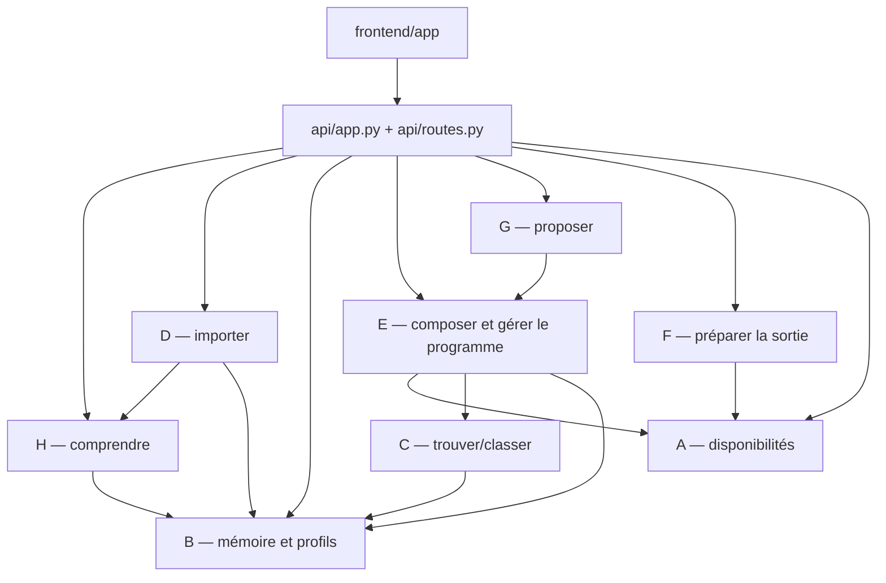
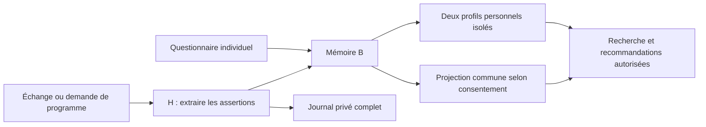

# Architecture et responsabilités

## Règle de lecture

**`api` expose, `streams` décident, `integrations` adaptent, `db` persiste.**
Il n’y a plus de dossier `domain` parallèle aux streams. Chaque stream possède
un `service.py` actuel ; `legacy.py` signifie exclusivement compatibilité V1.

L’organisation est MECE pour l’attribution des responsabilités : chaque capacité
a un propriétaire. Les streams collaborent ; ils ne sont pas indépendants et ne
constituent pas huit microservices. Aucun découpage supplémentaire en couches
models/repository/service n’est imposé à chaque stream.

## Carte A–H

| Stream | Propriétaire de | Entrée → sortie | Hors de sa responsabilité |
| --- | --- | --- | --- |
| A calendrier | Disponibilités, intersection, fuseau Paris, créneau de démo | Plages individuelles → plages communes | Goûts, choix des activités, réservation |
| B mémoire | Faits, consentements, provenance, recherche, profils, identité/entretiens | Faits autorisés → contexte filtré | Recherche de lieux et composition |
| C découverte | Catalogue, contraintes fortes, classement, favoris/aversions d’activité | Contexte B + créneau A → candidats scorés | Programmation finale et collecte de fichiers |
| D connecteurs | Analyse des exports, normalisation, déduplication, confirmation d’inspirations | Fichiers/textes → faits B avec provenance | Stockage mémoire indépendant ou téléchargement implicite |
| E orchestration | Assemblage B/C/A, faisabilité, programmes persistants, remplacement, statut, avis associés au programme | Candidats → DatePlan validé | Réservation et lecture du texte utilisateur stocké par H |
| F réservation | Préparation humaine et export ICS du programme accepté | DatePlan → actions/ICS | Paiement, confirmation chez un fournisseur, recherche d’activités |
| G proactivité | Opportunités, suggestions persistantes, temporisation et actions | Signaux autorisés → appel E et suggestion | Deuxième moteur de composition |
| H conversation | Compréhension locale, vocabulaire, conversation et extraction injectée | Texte → contraintes ou faits vers B | Propriété des profils et génération des itinéraires |

B expose les types de consentement. `B_memory/onboarding.py` gère identité et
entretiens ; `B_memory/service.py` reste le point d’entrée mémoire.
E expose les types `TimeWindow`, `CandidateActivity`, `DatePlan` dans `models.py` ;
les autres streams utilisent ce contrat existant. Ce sont des dépendances de
types, pas des appels au moteur E.

## Dépendances d’exécution

Les services accèdent à `backend/db` pour leurs tables et à `integrations` lorsque
nécessaire. OpenAI reçoit un schéma validé et utilise le vocabulaire H comme repli ;
le service de conversation H reçoit son adaptateur par injection. La validation
d’URL est dans `integrations/urls.py`, partagée par D et F.

Aucun stream n’importe `backend/api`. Le stockage n’importe ni stream ni API.
Les tests d’architecture vérifient ces règles et l’absence de cycle d’import Python
local. Ils protègent le graphe, pas une promesse de séparation parfaite de chaque
ligne de code.

## Frontière HTTP et fonctionnalités transverses

`api/app.py` compose le serveur et les routes historiques ; `api/routes.py` assemble
les services et expose les routes actuelles. L’API résout le membre/couple,
contrôle l’accès, valide les payloads et transforme les erreurs.
Elle coordonne aussi les opérations transverses d’effacement personnel, les
uploads privés et les commandes de démonstration. Ces opérations restent
explicites dans ce fichier : pas de dossiers supplémentaires sans besoin actuel.

Les décisions métier d’import, calendrier, découverte, composition, conversation
et réservation appartiennent aux streams. En particulier, les retours sur une
activité sont implémentés par C ; les avis sur un programme sont attachés à son
cycle de vie E, puis alimentent B. Il n’existe qu’une source de vérité mémoire.

## Compatibilité V1

Le planificateur E (`planner.py` et `models.py`) est partagé et conserve ses
algorithmes. Les petits modèles/dépôts/services B et C historiques sont réunis
dans leur `legacy.py`, avec leurs symboles et tests conservés. H et G gardent leur
service historique sous le même nom explicite. Le pipeline V1 appartient à
`E_orchestrator/legacy.py` ; son ancienne API autonome est dans
`api/legacy_orchestrator.py`. Les exports V1 des packages B/C/G/H sont conservés.

Les endpoints `/v1`, `/v1/demo`, `/static`, `/api/v2`, `/`, `/app`, `/v2-static`
restent identiques. Les chemins Python internes ont changé : aucun shim vide ou
alias dynamique ne masque l’emplacement réel du métier. Les imports internes et
ceux des tests ont été mis à jour ; les assertions de régression sont conservées.

## Fichiers à conserver et fichiers consolidés

- Conserver les tests : ils spécifient confidentialité, budget, faisabilité et compatibilité.
- Conserver `db/database.py` : schéma unique et migrations rétrocompatibles.
- Conserver les fixtures réellement lues : `mocks/E`, `mocks/peer` et le catalogue V1 de C.
- Les anciens exemples input/output, READMEs de streams, rapports et consignes de
  construction sont réunis dans `archive/HISTORY.md`, avec leurs chemins d’origine.
- Les interfaces de fournisseurs sans appelant ont été retirées ; l’adaptateur
  OpenAI réellement utilisé reste dans `integrations/openai.py`.
- Les tests frontend vivent dans `frontend/tests` ; `experiences.mjs` contient les
  parcours inspirations/disponibilités/comparaison/export, auparavant nommés merge.

L’organisation des fichiers ne change ni le schéma SQL ni les consentements.
Vérification complète : `bash scripts/check.sh`.

## Tests et noms de version

Tous les tests Python sont dans `backend/tests/`, en huit fichiers par responsabilité :
API, parcours, mémoire, découverte, orchestration, OpenAI, compatibilité V1 et
architecture. Aucun test ne reste au milieu des services applicatifs. Les tests
similaires en apparence couvrent des couches différentes (métier, HTTP, persistance) ;
leurs assertions ne sont pas supprimées pour réduire artificiellement le nombre de fichiers.

Les noms de livraison disparaissent des fichiers actuels : `frontend/app/`,
`api/routes.py`, `requirements.txt`, `scripts/run.sh`, `init_demo.py`,
`reset_demo.sh`, `test_offline.py`. Les identifiants `/api/v2`, `/v2-static`,
les tables SQL `v2_*` et le répertoire de mémoire de construction `docs/v2`
sont conservés : ce sont des contrats/historiques, pas des copies du produit.

## Boucle de mémoire continue

H capture les interactions, B consolide les faits et leurs sources. Même goût :
renforcement ; changement explicite : ancienne version conservée, nouvelle active.
Les envies ont une échéance ; le journal n'expire pas avec elles. La projection
commune référence les faits partagés et se recalcule après mutation/révocation.
Elle ne contient pas les messages privés. Une préférence d'un membre ne remplace
jamais l'aversion de l'autre membre dans son profil personnel.

Les écritures d'un échange sont atomiques. Les reçus idempotents sont persistants,
isolés par propriétaire et effacés avec ses messages. Aucun retraitement automatique
des anciens messages ne recrée un fait supprimé. La recherche existante reste
locale (lexicale, tokens hachés, récence/salience), pas un modèle sémantique avancé.
Le journal est paginé ; les tokens de membre restent le mécanisme d'identité locale
existant. La frontière optionnelle MemoryBackend ne connecte pas Mem0 en production.

## Ajout Discover vocal

`frontend/app/voice.mjs` complète Discover : micro sur clic, conversion WAV,
transcription corrigible, dialogue guidé et lecteur. `H_conversation/voice.py`
pose les questions et reçoit le planner par injection ; l'API applique les
contrôles d'identité puis assemble les services. `integrations/gradium.py`
assure la transcription/synthèse REST derrière activation explicite.
E reste propriétaire des recommandations. Aucun souvenir brut envoyé au
fournisseur, aucune nouvelle table, aucune dépendance de H vers l'API.
Le dialogue est temporaire ; les plans restent persistants. Voir GRADIUM.md.

L’interface voice.mjs utilise maintenant un cercle à états lecture/écoute/attente,
avec envoi automatique de la transcription interne et clavier de repli fermé.
Les événements du lecteur audio pilotent l’état visuel, sans nouveau service.

## Calendrier Google par import iCal

UI Nos disponibilités → API authentifiée → adaptateur integrations/google_calendar
(téléchargement Google borné, parsing récurrences) → stream A (soustraction des
occupations aux plages quotidiennes, persistance des créneaux libres) → intersection
A existante → E. Aucun changement du contrat TimeWindow ni du planner.
Les métadonnées propriétaires sont dans v2_calendar_imports ; liens secrets et
événements ne sont pas persistés. Import ponctuel, pas de synchronisation de fond.
Documentation et configuration dans GOOGLE_CALENDAR.md.

## Dialogue Ask connecté

H `dialogue.py` possède les sessions privées et la décision de dialogue validée
par `integrations/dialogue.py`. Il reçoit E, C réel et C web par injection.
C `recommendations.py` classe les fiches de `ActivitySource` sans calendrier, puis
adapte uniquement les événements complets en CandidateActivity pour E. E accepte
un fournisseur de candidats injecté et une requête déjà structurée, sans changer
les routes historiques. L’API assemble ces services ; SQLite reçoit l’extension
additive discovery_dialogue=1. Voir ASK_DIALOGUE.md.

Le point d’entrée UI est Ask. Discover reste une liste filtrable d’activités.
Le backend canonique utilise /ask/chat ; /discover/chat reste un alias pour
les anciens clients. Les services C/H/E et le stockage sont réutilisés.
